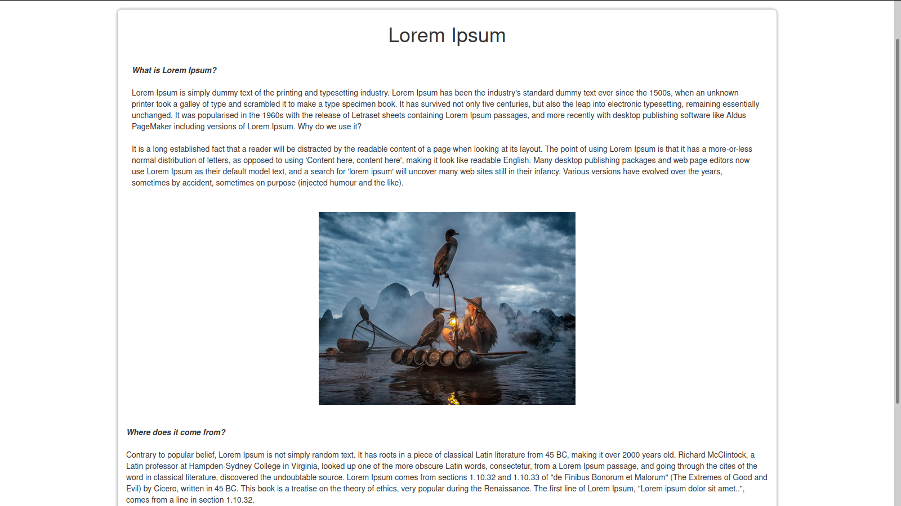

# PERSONAL BLOG NODE

Personal blog with comment section developed on Node.js.

## Download

On the designated folder, clone the repository in the terminal with the following code:

```
$ git clone https://github.com/rgdotta/personal-blog-node.git
```

### Install

To install the dependencies, on the repository folder, type the following code on the terminal:

```
$ npm install
```

After that, start the local server with:

```
$ npm start
```

The aplication will start on: https://localhost:3000/

## Technologies:

- ES6+
- Node.js
- MongoDB with mongoose
- EJS
- Bcrypt
- Nodemailer
- Bootstrap

## Next steps:

This is still a work in progress, here is what is in my plans fot this project:

- Add page limiter to home.
- Overall css style.

## Screenshots

### Home


### Post



You can search by title or the post content.


### All CRUD methods are aplied.

Create:


Read:


Update:


Delete:

.png)

### Authentication

The authentication is done with bcrypt and environment variables. Because of the simplicity of the blogger options, there's no need to mantain a session.


----


----

Edit:


----

Delete:


### Contact

Mail message delivery using nodemail.


