# Personal Node.js Blog

Personal blog project wrote in node.js and EJS, using MongoDB has database.

## Home

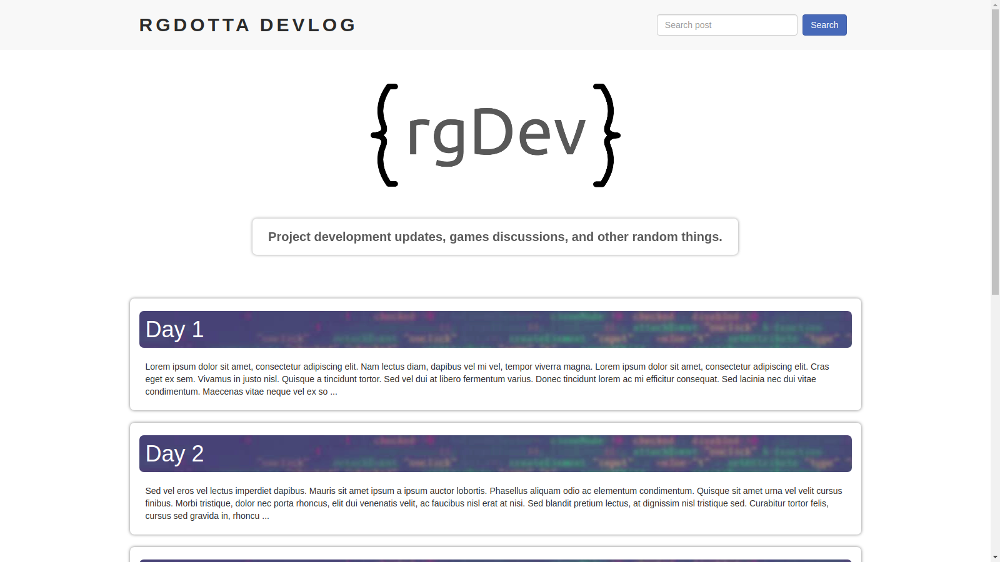

## Post

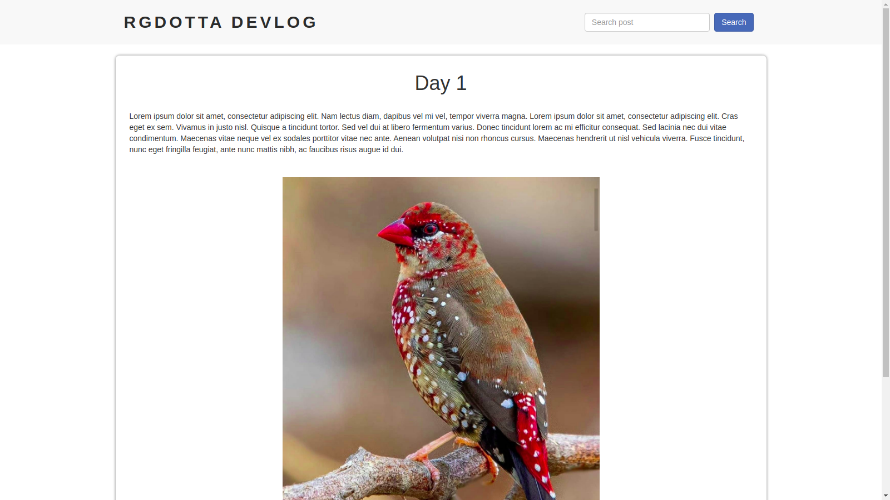

You can search by title or the post content.

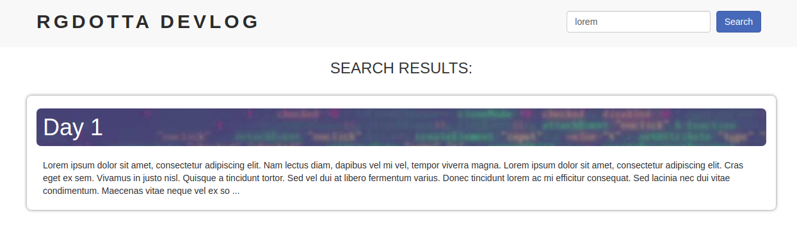

## All CRUD methods are aplied.

Create:

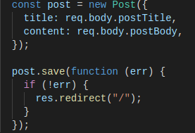

Read:

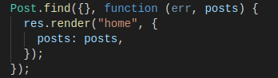

Update:

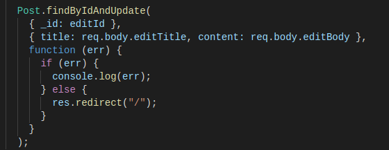

Delete:

.png)

## Authentication

The authentication is done with bcrypt and environment variables. Because of the simplicity of the blogger options, there's no need to mantain a session.

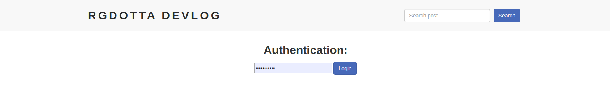

----

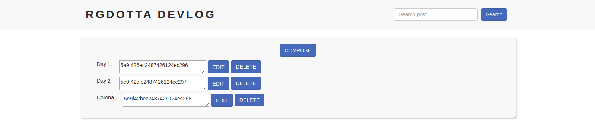

----

Edit:

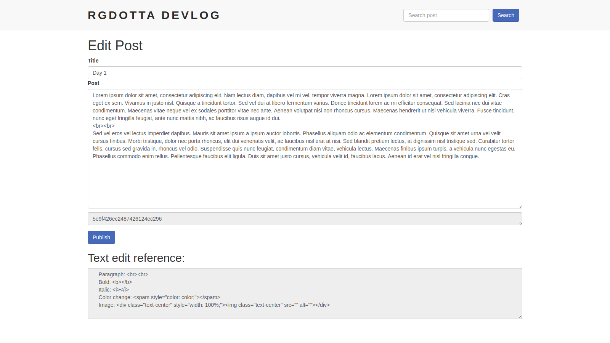

----

Delete:

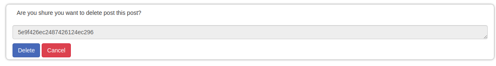

## Contact

Mail message delivery using nodemail.

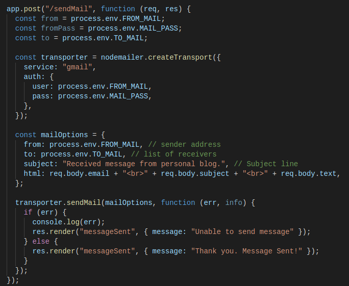

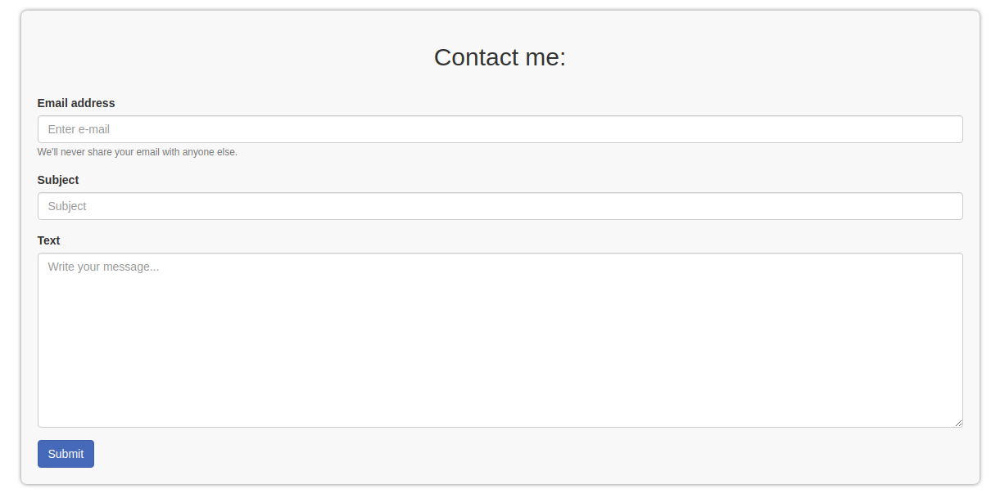

## Next steps:

This is still a work in progress, here is what is in my plans fot this project:

- Add comment section.
- Add info and links to resume, github and linkedin to footer.
- Add page limiter to home.
- Change overall style.
